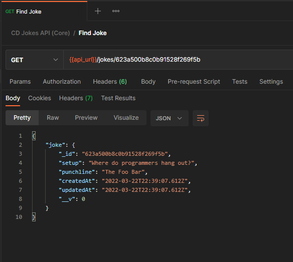

## Jokes API (Core)
### Local API

1. Create a user and password to access **jokesapi** database on MongoDB

```
  use jokesapi
  db.createUser({user: <your_database_user>, pwd:<your_database_password>, roles:["dbOwner"]})
```

2. Create an **.env** file using **.env.example** template 
   
```
  DB_USER=<your_database_user>
  DB_PWD=<your_database_password>
  DB_PORT=27017
  DB_HOST="127.0.0.1"
  PORT=8000
```

3. Use Postman to test Jokes API (Core)

    **Joke Model**
    ```
      {
        "setup": "Why do developers love to use dark themes?",
        "punchline": "Because light attracts bugs. Ba-dum-tss!"
      }
    ```

    **{{api_url}} variable**
    ```
    http://localhost:8000/api
    ```

    * **GET** All jokes<br/>
      
    * **GET** Find Joke<br/>
      
    * **GET** Random Joke<br/>
      
    * **POST** Create a Joke<br/>
      
    * **PUT** Edit a Joke<br/>
      
    * **DELETE** Remove a Joke<br/>
      